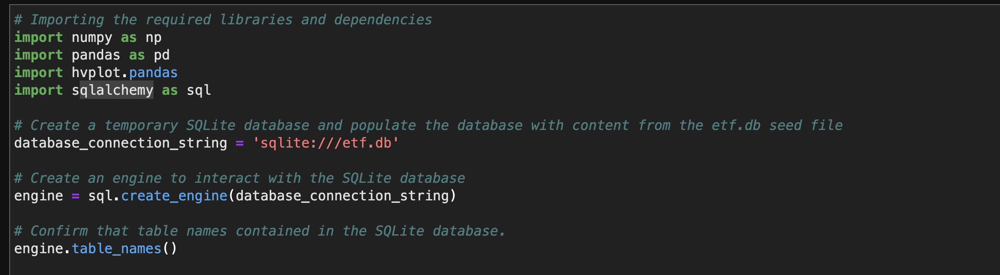

# **Web Application ETF Analyzer**

## Overview

The ETF analysis tool is being able to create SQL queries to filter information from the provided database and create a dataframe in collaboration with the pandas library. It will also analyze the daily returns of each ticker, cumulative returns and create a line graph to visualize the information over time.

---

## Technologies

This project leverages **[python version 3.8.5](https://www.python.org/downloads/)** with the following packages and modules:

* [pandas](https://pandas.pydata.org/docs/) - This was used to be able to easily manipulate dataframes.

* [Jupyter Lab](https://jupyterlab.readthedocs.io/en/stable/) - This was used to be able to create and share documents that contain live code, equations, visualizations and narrative text.

* [PyVizlot](https://pyviz.org/) -  Python visualization package that provides a single platform for accessing multiple visualization libraries. Two of the libraries are:

    * [plotly.express](https://plotly.com/python/plotly-express/) - This was used for data visualizatio for a rapid figure generation.

    * [hvPlot](https://hvplot.holoviz.org/index.html) -  This was used to be able to have an interactive plotting tool such as a line/bar graph.

* [Numpy](https://numpy.org/install/) - This provides the ability to work with arrays and use different mathematical calculations  on arrays.

* [Sqlalchemy version 1.3.20](https://anaconda.org/anaconda/sqlalchemy) - This is the Python SQL toolkit and Object Relational Mapper that gives application developers the full power and flexibility of SQL.

* [Voilà](https://github.com/voila-dashboards/voila) - This will allow us to view our ETF Analyzer on the web.

---
## Installation Guide

### 1. Installing and Running Jupyter notebook

On the terminal, under the conda dev environment, type the code below:

`pip install jupyterlab`

#### * Opening Jupyter notebook

If you have Jupyter Lab already installed, to open your Notebook and be able to view your hidden files, please type this while on your conda dev environment:

`jupyter lab --ContentsManager.allow_hidden=True` 

Once you click ENTER, this will open on your default browser.

---

### 2. Installing PyViz Ecosystem

 - To install the PyViz packages, check that your development environment is active, and then run the following command:

    `conda install -c pyviz hvplot`

- PyViz also require specific version of NodeJS check that your development environment is active, and then run the following command:

    `conda install -c conda-forge nodejs=12`

- To confirm the installation of all the PyViz packages, then run the following command:

    `conda list plotly`

    `conda list hvplot`
    
    `conda list nodejs`

    See screenshot below:

### 3. Installing SQLAlchemy
- To install the SQLAlchemy, check that your development environment is active, and then run the following command:

    `conda list sqlalchemy`
- If SQLAlchemy is already installed, sqlalchemy and its version number will display in your terminal, as the following image shows:

    

- If sqlalchemy doesn’t display in your terminal, you need to install it. To do so, follow these steps:
    - With your Conda dev environment still active, run the following command:

        `pip install SQLAlchemy`
    
    - When the installation completes, confirm it by running the following command:

        `conda list sqlalchemy`

---
## Examples

Here are some of the data visualization we did for this project.

---

## Usage

- We try to try to use SQLalchemy to read data from the database/.db file.

    

- Here is using the voila in the terminal to show the ETF analyzer tool.

    

---

## Contributors

Contributed by: Justine Cho

Email: chojustine0@gmail.com

[ LinkedIn](https://www.linkedin.com/in/justinecho)

---

## License

### **MIT License**

Copyright (c) [2021] [Justine Cho]

Permission is hereby granted, free of charge, to any person obtaining a copy
of this software and associated documentation files (the "Software"), to deal
in the Software without restriction, including without limitation the rights
to use, copy, modify, merge, publish, distribute, sublicense, and/or sell
copies of the Software, and to permit persons to whom the Software is
furnished to do so, subject to the following conditions:

The above copyright notice and this permission notice shall be included in all
copies or substantial portions of the Software.

THE SOFTWARE IS PROVIDED "AS IS", WITHOUT WARRANTY OF ANY KIND, EXPRESS OR
IMPLIED, INCLUDING BUT NOT LIMITED TO THE WARRANTIES OF MERCHANTABILITY,
FITNESS FOR A PARTICULAR PURPOSE AND NONINFRINGEMENT. IN NO EVENT SHALL THE
AUTHORS OR COPYRIGHT HOLDERS BE LIABLE FOR ANY CLAIM, DAMAGES OR OTHER
LIABILITY, WHETHER IN AN ACTION OF CONTRACT, TORT OR OTHERWISE, ARISING FROM,
OUT OF OR IN CONNECTION WITH THE SOFTWARE OR THE USE OR OTHER DEALINGS IN THE
SOFTWARE.
